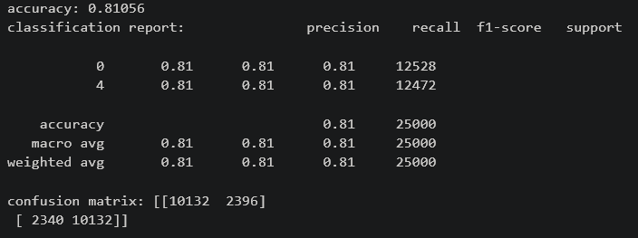
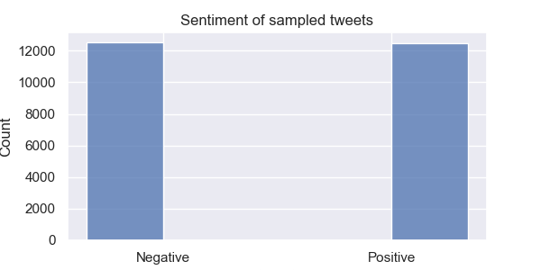
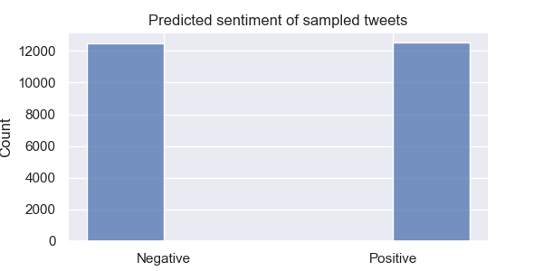
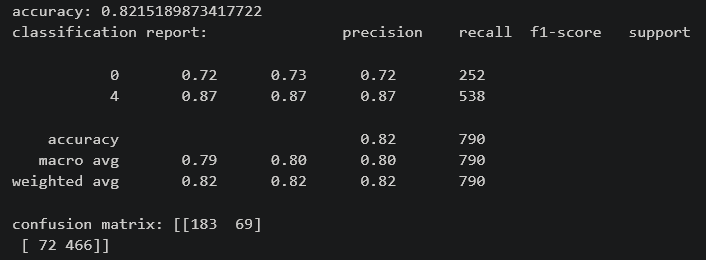
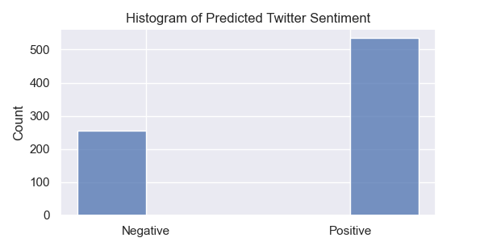
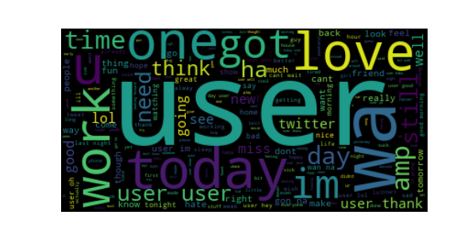
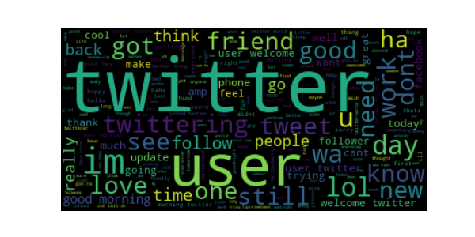

# **NLP-Twitter-Sentiment-Analysis**
In this project I performed sentiment analysis on a dataset of 1.6 million tweets from [Kaggle](https://www.kaggle.com/datasets/kazanova/sentiment140) (sampled down to 100,000). I preprocessed them and generated vector embeddings with BERT, then trained a logistic regression model to predict each tweet's sentiment.

With a logistic regression model, I achieved an accuracy score of 0.81:  
  

_______
## Predicting sentiment on a specific company
From the sampled dataset, I then grabbed only tweets containing "twitter" to see how the model scores them and to get a glimpse of public sentiment towards the company and platform. I was supposed to do this for an AI company, but I couldn't find such a company with over 100 tweets in my sampled dataset. But  twitter is sort of an AI company now...  

  
**Looks like sentiment is mostly positive. Many twitter users wouldn't have predicted this!**

### Word Cloud

### Word Cloud of tweets about Twitter

## Training Alternative Models
I trained a **Multinomial Naive Bayes** model and got a score of 0.70
I also trained a **Gradient Boosted Classifier** model and after trying different learning rates, number of estimators, and max depths, got a score of 0.786